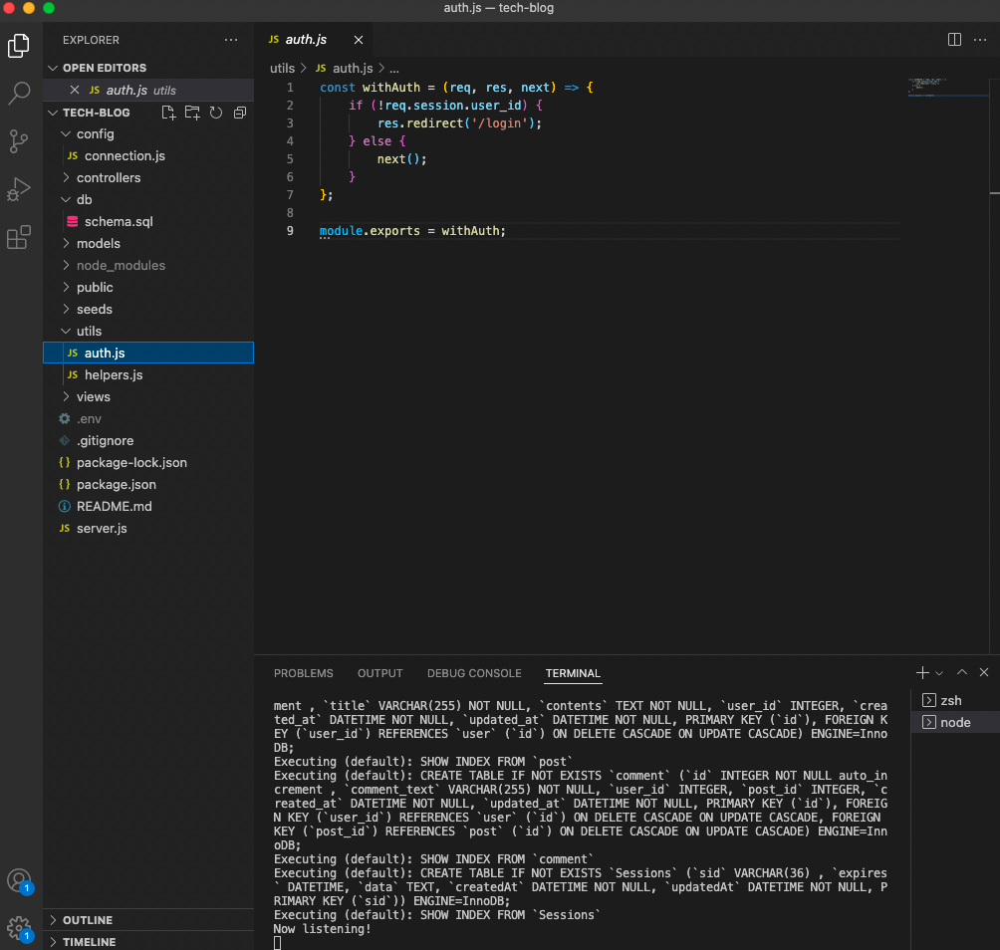
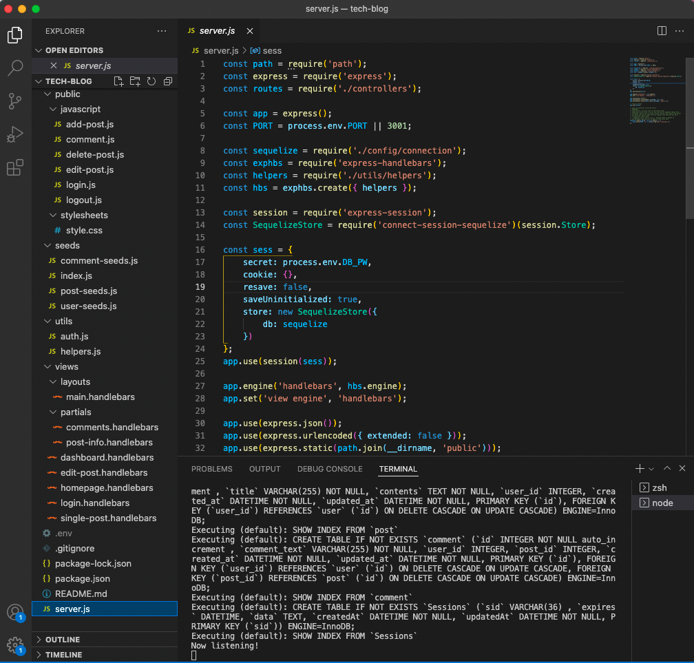
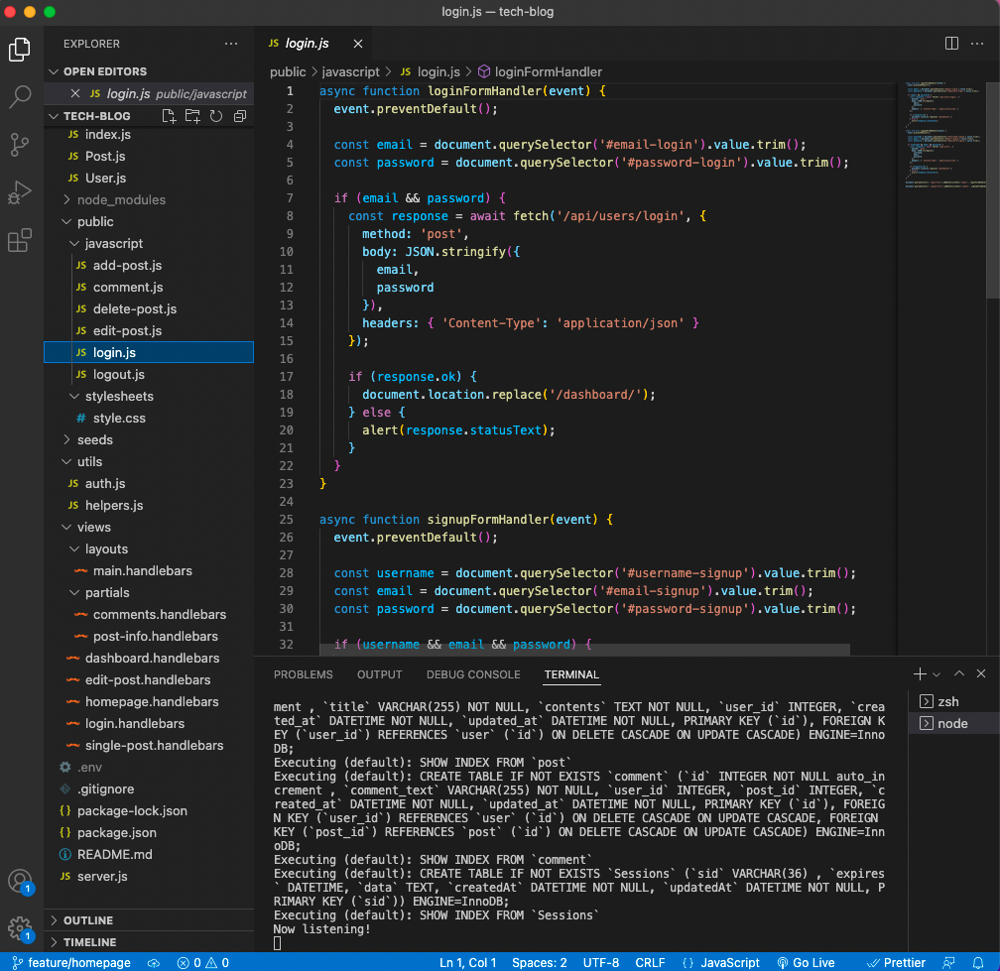
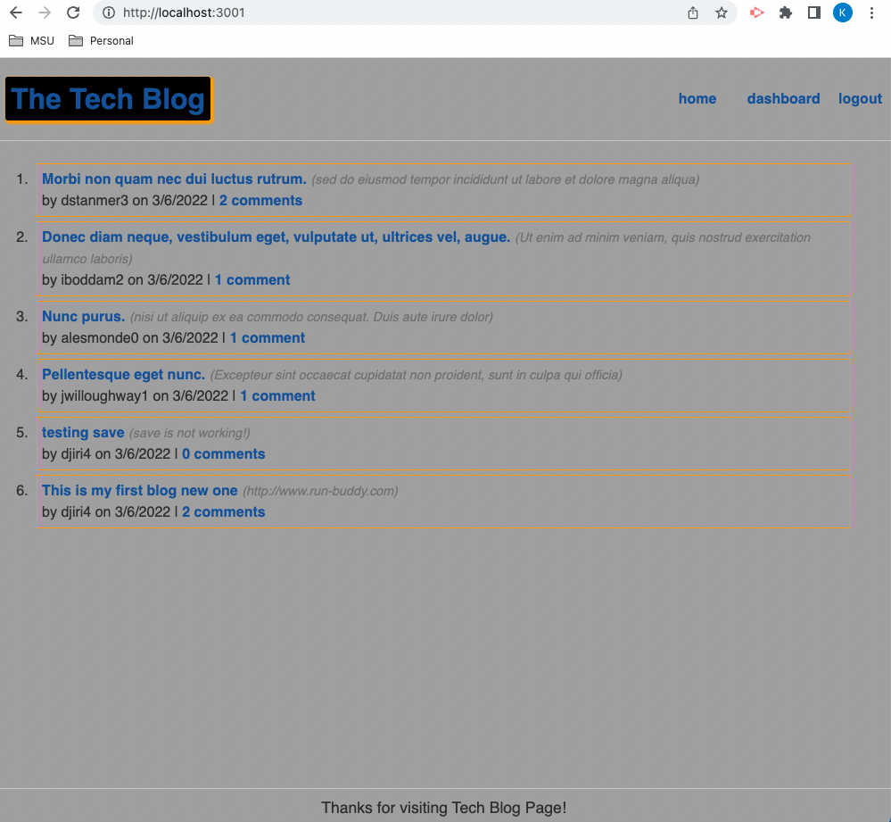
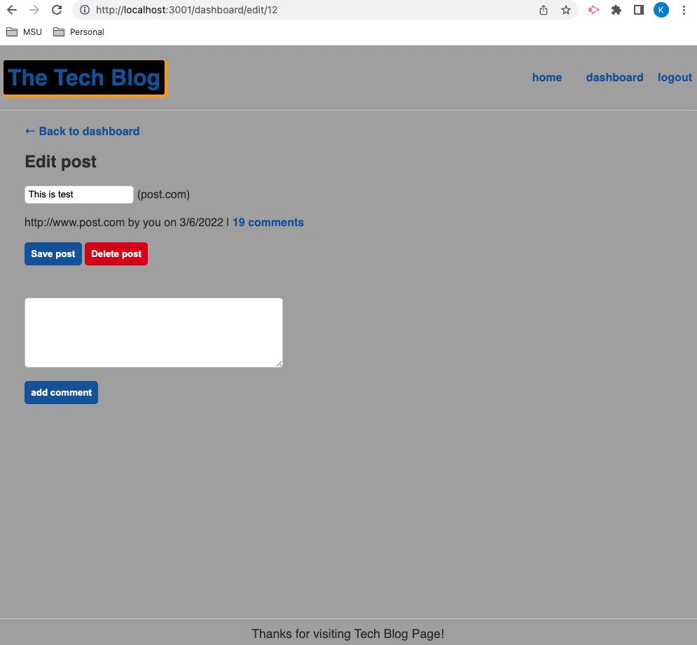

# TECH BLOG

## Table of contents

1. [Title](#title)
2. [Description](#description)
3. [Installation](#installation)
4. [Usage](#usage)
5. [Contributing](#contributing)
6. [Test](#test)
7. [License](#license)
8. [Questions](#questions)

## Title

TECH BLOG

## Description

CMS-style blog site similar to a Wordpress site, where developers can publish their blog posts and comment on other developers’ posts as well.

## Installation

Run `npm install` `and get the path of the `db\schema.sql`to get the database created and`npm run seed` to seed data to the database tables

## Usage

start application with `npm start` or `node server.js` command

## Contributing

Always create a PR with own branch and push for review/approval

## Test

Test on local environment and once ready do PR to the repository

## License

[MIT](https://gist.github.com/nicolasdao/a7adda51f2f185e8d2700e1573d8a633#mit-license)

## Questions

No question at this time 
Find me on Github [kazichaska](https://github.com/kazichaska) 
Email me with any question: kazichaska@gmail.com  

## Deployed Application Video Link

Below is the recorded video link of deployed application and how to use it:
https://powerful-forest-82738.herokuapp.com/

## Screenshots of the code

